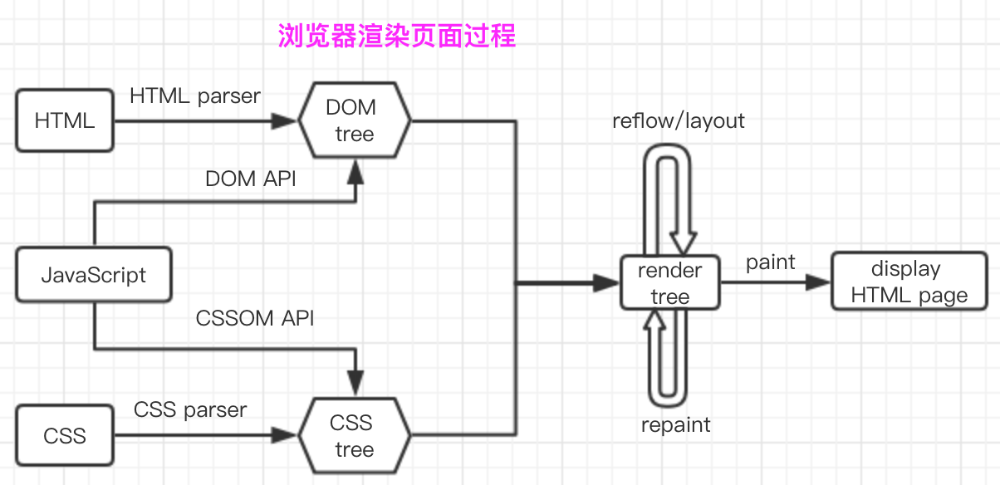

# http 协议  

http 协议有以下几个特点
* 无连接 
* 无状态
* 简单快速灵活 

请求报文  
1. 请求行 （请求方法，url ，协议版本）
2. 请求头 (客户机环境的key, value。Content-type等)
3. 空行
4. 请求体

响应报文  
1. 响应行 （协议版本，状态码，状态码的短语）
2. 响应头 （key，value值）
3. 空行
4. 响应体 

# post和get的区别
* get 在浏览器回退时不会重复提交，post 会
* get 的 url 的地址会被收藏，post 不会
* get 请求会被浏览器缓存
* get 请求的 url 有长度限制，post 没有
* get 相对 post 不安全
* get 请求的参数会放在 url 中，post 的参数会放在 request body 中  

# http状态码  

1. 1xx： 请求已接受正在处理
2. 2xx： 请求成功 200 OK: 请求被正确处理
3. 3xx： 重定向 301：永久性重定向
4. 4xx： 客户端错误 404: 在服务器未找到资源 403: 访问的资源没服务器拒绝
5. 5xx： 服务端错误 503: 服务器无法处理请求，超负载或停机  

# TCP三次握手与四次挥手  

### 三次握手  

1. 客户端发送一个 syn 数据包到服务端，进入 syn send 状态，等待服务端确认
2. 服务端收到 syn 包后也会发送一个客户端，进入 syn recv 状态
3. 客户端收到服务端的 syn 包后想服务端发送确认包 

### 四次挥手  

1. 主动关闭方发送一个 FIN 数据包到服务端，用来关闭主动方到被动方的数据传输，告诉被动方我已不再发送数据了
2. 被动方收到 FIN 包后发送一个确认包到主动方
3. 被动方发送一个 FIN 包到主动方
4. 主动方收到被动方发送的 FIN 包后返回一个确认包  

# 从输入 URL 至页面渲染  

1. 浏览器拿到 url 并解析 DNS
2. 根据解析的 IP + 端口 发起 HTTP 请求
* 请求包含 请求行（请求的方法，url， 协议）请求头（一些必要信息，cookie 等） 请求体等内容
* 请求通过 TCP 的三次握手完成后将数据发送给请求的服务器
* 接收方在收到 http 请求后，开始查找请求的文件资源，并将资源发送给浏览器
3. 浏览器解析请求返回的内容  

  

1. HTML parser：HTML解析器，其本质是将HTML文本解释成DOM tree。
2. CSS  parser：CSS解析器，其本质是讲DOM中各元素对象加入样式信息
3. JavaScript引擎：专门处理JavaScript脚本的虚拟机，其本质是解析JS代码并且把逻辑（HTML和CSS的操作）应用到布局中，从而按程序要的要求呈现相应的结果
4. DOM tree:文档对象模型树，也就是浏览器通过HTMLparser解析HTML页面生成的HTML树状结构以及相应的接口。
5. render tree：渲染树，也就是浏览器引擎通过DOM Tree和CSS Rule Tree构建出来的一个树状结构，和dom tree不一样的是，它只有要最终呈现出来的内容，像或者带有display:none的节点是不存在render tree中的。
6. layout：也叫reflow 重排，渲染中的一种行为。当rendertree中任一节点的几何尺寸发生改变了，render tree都会重新布局。
7. repaint：重绘，渲染中的一种行为。render tree中任一元素样式属性（几何尺寸没改变）发生改变了，render tree都会重新画，比如字体颜色、背景等变化。  

主要流程：  
1. 浏览器通过HTMLParser根据深度遍历的原则把HTML解析成DOM Tree。
2. 将CSS解析成CSS Rule Tree（CSSOM Tree）。
3. 根据DOM树和CSSOM树来构造render Tree。
4. layout：根据得到的render tree来计算所有节点在屏幕的位置。
5. paint：遍历render树，并调用硬件图形API来绘制每个节点。  

# 性能优化  

1. 对于css  

* 压缩 css 文件  
* 选择器合并，把有相同属性的选择器组合在一起  
* 雪碧图
* 避免通配符 

2. JavaScript  
* 尽可能把script标签放到body之后  
* 尽可能合并 js 代码
* 压缩 js 文件
* 避免 js 操作 Dom ，设置好 css 样式，通过改变样式名来修改 Dom   


## DNS 解析过程  

1. 浏览器会根据地址在本地缓存中查找 DNS 解析记录，如果有就返回 IP 地址，如果没有就会像域名服务器发起请求解析这个域名。
2. 首先后像本地域名服务器（LDNS）发起请求解析，如果没有就会像根域名服务器发起解析请求


# 跨域通信的几种方式  

1. JSONP
2. Hash
3. postMessage
4. WebSocket
5. CORS

## JSONP  

ajax请求受同源策略的影响，不允许进行跨域请求，而script标签src属性中的链接却可以访问跨域的js脚本。用户在src属性中传递一个callback参数给服务端，服务端返回数据时会将这个callback参数作为函数名来包裹住JSON数据并返回给客户端。  

```javascript
// callback的值对应到页面一定要定义一个全局函  
// 服务端返回的是一个函数的调用，调用的时候会把json数据作为参数包在这个函数里面

function JsonpCallback(data) {
    console.log(data)
}

<script src='xxx?callback=JsonpCallback'></script>
```

## Hash  

url中#后面的内容就叫Hash，hash的改变不会引起页面的刷新。
		
页面A通过iframe嵌入了页面B，页面A发送消息给页面B  


## postMessage  

postMessage是html5引入的API,postMessage()方法允许来自不同源的脚本采用异步方式进行有效的通信,可以实现跨文本文档,多窗口,跨域消息传递.多用于窗口间数据通信,这也使它成为跨域通信的一种有效的解决方案。  

```javascript
otherWindow.postMessage(message, targetOrigin, [transfer]);

// otherWindow 窗口的一个引用,  
// message 要发送到其他窗口的数据  
// targetOrigin 通过窗口的origin属性来指定哪些窗口能接收到消息事件,设置为通配符"*"表示可以发送到任何窗口,如果想要发送到与当前窗口同源的窗口,可设置为"/"
// transfer 可选属性,

// 接收数据: 监听message事件的发生  
window.addEventListener("message", receiveMessage, false) ;
function receiveMessage(event) {
     var origin= event.origin;
     console.log(event);
}

```

## CORS  

支持CORS请求的浏览器一旦发现ajax请求跨域，会对请求做一些特殊处理，对于已经实现CORS接口的服务端，接受请求，并做出回应。  

浏览器对跨域请求区分为“简单请求”与“非简单请求”  

“简单请求”满足以下特征：  

（1) 请求方法是以下三种方法之一：
     HEAD
     GET
     POST
（2）HTTP的头信息不超出以下几种字段：
     Accept
     Accept-Language
     Content-Language
     Last-Event-ID
     Content-Type：
         application/x-www-form-urlencoded、 multipart/form-data、text/plain  

### 简单请求  

浏览器判断为简单请求后会在 Reauest Header 中添加 Origin (协议 + 域名 + 端口) 字段，来表示请求原源，CORS 服务端会将该字段作为跨源标志。  

CORS 接受到请求后，会首先判断 Origin 是否是允许源范围之内，如果验证通过，服务端会在 Response Header 添加 Access-Control-Allow-Origin 等字段。  

浏览器接收到 Response 后会判断自己是否存在 Access-Control-Allow-Origin 允许源中，如果不是会抛出同源检测异常。  

## WebSocket  

WebSocket协议最大的特点就是解决了http协议只能单方面发送请求的问题。服务端可以主动向客户端推送消息，客户端也可以主动向服务端发送消息。  

特点：  

1. 建立在tcp协议之上。
2. 性能开销小
3. 没有同源限制
4. 协议标示符是ws如果是加密则为wss  

```javascript
var Socket = new WebSocket(url)

// 只读
// 0：连接尚未建立 1: 连接已建立可以通信 2: 连接正在关闭  3: 连接已经关闭
Socket.readyState 

// 获取还有多少数据没有发送出去，用来判断是否发送结束
bufferedAmount

// 连接建立时触发
onopen

// 客户端接收到服务端数据时触发
onmessage

// 通信发生错误时触发
onerror

//连接关闭时触发
onclose

// 发送数据
send

// 关闭连接
close		
```

